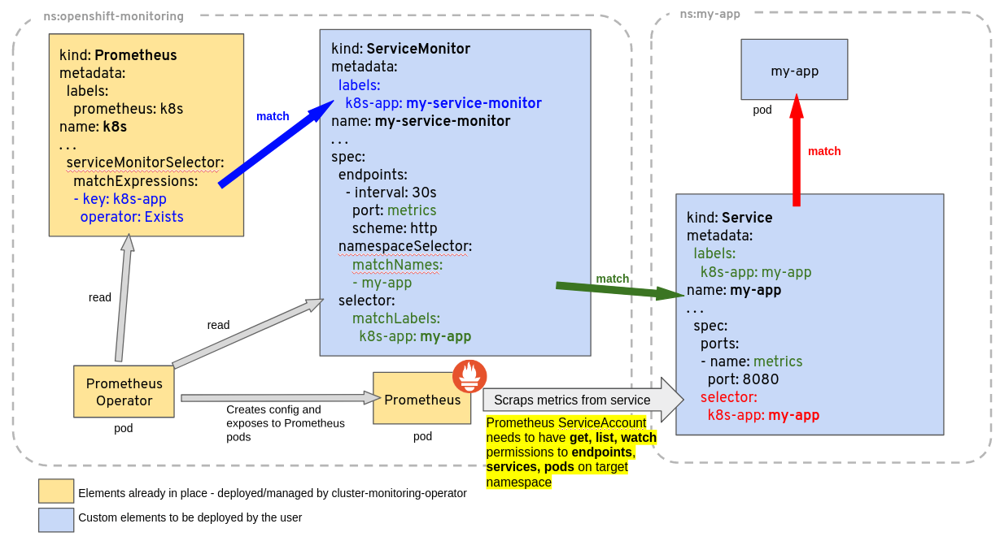

# target-exporter

Go service that exports a metrics endpoint with the targets for each node.

## Setup

```bash
helm install target-exporter charts/target-exporter --namespace=target-exporter --create-namespace 
```

to uninstall:

```bash
helm uninstall -n target-exporter target-exporter
```

See also NOTES.txt

## Build

E.g.:

```bash
docker build -t target-exporter .
docker login
docker tag target-exporter cristianohelio/target-exporter:0.0.1
docker push cristianohelio/target-exporter:0.0.1
```

then scale down & up the deployment to reapply the image (if tag didn't change, remember to set `pullPolicy: Always` in
the deployment)

```bash
kubectl scale deployment target-exporter --replicas=0 -n target-exporter 
kubectl scale deployment target-exporter --replicas=1 -n target-exporter 
```

## How does it work



### Notes

- Port-forward with `kubectl port-forward -n kube-prom-stack prometheus-kube-prometheus-stack-prometheus-0 9090`
  and check under `Status > Targets` if the target was scraped successfully.

https://prometheus.io/docs/instrumenting/writing_exporters/#target-labels-not-static-scraped-labels

### TODOs

- [x] Prometheus doesn't have permission to scrape resources in namespaces different from its own (kube-prom-stack). It
  would be better to place target-exporter into its own namespace and give Prometheus permission to scrape it.
- [x] Create Helm chart
- [x] Create a metric like `cpu-diff` and create a timeseries per each node with test values.
- [ ] Publish image in GCP
  registry https://console.cloud.google.com/gcr/images/k8s-ecoqube-development?project=k8s-ecoqube-development
- [ ] Swap out plain Prometheus in TAS cluster for kube-prometheus-stack or just add the Prometheus Operator and deploy
  service
- [ ] Health and readiness checks